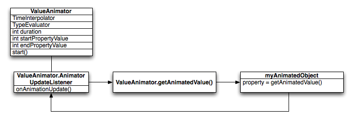

# 动画概览
## Animate bitmaps（动画位图）
动态变化一个小标志, 用 Animate Drawable Graphics.
## Animate UI visibility and motion
改变布局中的一个view的位置或visibe属性
## Physics-based motion
物理运动
Two common physics-based animations are the following:
* Spring Animation
* Fling Animation、

使用ObjectAnimator API构建的动画相对静止，并且就固定的持续时间。如果想做出更改，则需要先取消动画，使用新的属性设置，然后在重新配置动画（不连贯）。

基于物理的动画API构建的动画DynamicAnimation是由力驱动的，目标值的变化导致力的变化，新力量适用于现有的速度，从而不断向新目标过渡。
## 动画布局更改
可以使用转化框架在当前活动或片段中交换布局时创建动画。只需要指定开始和结束布局，以及要使用的动画类型（有点像幻灯片切换）。
可以用来交换整个UI或仅仅移动/替换一些视图。


起始布局和结束布局均存储在a中Scene，但起始场景通常是从当前布局自动确定的。然后创建一个Transition告诉系统所需的动画类型，然后调用TransitionManager.go()，系统运行动画来交换布局。

## 活动之间的动画（Android5.0 API 21）
创建活动之间转换的动画，基于动画布局更改的相同转换框架，支持在不同活动中的布局之间创建动画。

startActivity()，通过他提供的一组选项ActivityOptions.makeSceneTransitionAnimation(),这个选项可以包括在活动之间共享哪些视图，因此转换框架可以再动画期间连接他们。

#Property Animation Overview
属性动画系统，当想要对属性动画更改，只需要更改他的一些属性值，比如移动到哪里、时间长度等。

属性动画系统允许定义动画的一下特征：
* 持续时间（duration）：指定动画的持续时间，默认长度为300ms
* 时间差值：指定通过时间计算属性值的函数
* 重复计数和行为：指定是否在到达持续时间结束时重复动画及重复动画的次数。还可以指定是否要反向播放动画。
* 动画设置：将动画分组为一起或按顺序或在指定延迟后播放的逻辑集。
* 帧刷新延迟：指定刷新动画帧的频率。默认每10ms刷新一次，但应用程序刷新帧的速度最终取决于系统整体的繁忙程度以及系统为基础计时器提供服务的速度。

## 属性动画工作原理
属性动画的类继承关系。


在ValueAnimator封装多个成员：
* TimeInterpolator : 定义差值函数
* TypeEvaluator：定义被更改的属性的计算方式

当ValueAnimator计算完成百分比时，他调用当前设置的TimeInterpolator来计算内插分数。

## 视图动画（view animation）和属性动画（property animation）的区别
视图动画仅仅提供为View对象设置动画的功能，因此如果需要为非View对象设置动画，则必须要通过代码实现自己的逻辑。另外，view动画受到约束，因为仅仅暴露了View对象的一些方面。

view动画另一个缺点是，它只修改绘制View的位置，而不是View本身。比如说对于一个按钮在屏幕上移动，该按钮会被正确绘制，但是单击该按钮的实际位置没有改变。

使用属性动画系统，没有这些限制，可以为任何对象的任何属性设置动画，并且实际上修改了对象本身。

# 为可绘制图形添加动画
## Use AnimationDrawable
在xml中定义多帧图像：
```xml
<animation-list xmlns:android = "http://schemas.android.com/apk/res/android"
    android:oneshot = "true" >
    <item android:drawable = "@drawable/rocket_thrust1" android:duration = "200" />   
    <item android:drawable = "@drawable/rocket_thrust2" android:duration = "200" />   
    <item android:drawable = "@drawable/rocket_thrust3" android:duration = "200" />   
</animation-list>
```
然后可以在代码里控制播放（oneshot=true会控制播放一次后，停留在最后一帧，false会循环播放）。
```java
AnimationDrawable rocketAnimation ;

public void onCreate ( Bundle savedInstanceState ) {  
  super . onCreate ( savedInstanceState );
  setContentView ( R . layout . main );

  ImageView rocketImage = ( ImageView ) findViewById ( R . id . rocket_image );
  rocketImage . setBackgroundResource ( R . drawable . rocket_thrust );
  rocketAnimation = ( AnimationDrawable ) rocketImage . getBackground ();

  rocketImage . setOnClickListener ( new View . OnClickListener () {  
      @Override
      public void onClick ( View view ) {  
        rocketAnimation . start ();
      }
  });
}
```
AnimationDrawable的start方法不能在Activity的onCreate方法中运行，因为这时AnimationDrawable还没有完全适配窗口。可以再onStart()方法中调用。

## Use AnimatedVectorDrawable
矢量绘制，不失真。

参考[简书](https://www.jianshu.com/p/53759778284a)文档：

# 动画类型
> 动画类型分为两大类：
* 视图动画（View Animation）
  * 补间动画（Tween Animation）
  * 逐帧动画（Frame Animation）
* 属性动画（Property Animation）

### 视图动画
> * 作用对象：视图（View）
* 具体分类：补间动画 & 逐帧动画

#### 补间动画
> 简介：
* 作用对象：视图控件，例如TextView、Button等，不可作用于View组件的属性，如颜色、背景等
* 原理：通过确定开始视图样式 & 结束视图样式 & 中间动画变化过程 由系统补全来确定一个动画
* 动画类型
    * 平移动画（Translate）
    * 缩放动画（scale）
    * 旋转动画（rorate）
    * 透明度动画（alpha）
* 特点：
    * 优点：使用方便、简单，已封装好基础动画效果
    * 缺点：仅控制整体效果，无法控制属性
* 应用场景：
    * 视图中，标准、基础的动画效果
    * Activity、Fragment的切换效果
    * 视图组中子元素的出场效果

> 分类：根据不同的动画效果，补间动画分为4种动画，不同类型的动画对应于不同的子类。

|名称 | 原理     | 对应的Animation的子类|
| :------------- | :------------- |:------------- |
| 平移动画     |    移动视图的位置    | TranslateAnimation类|
| 缩放动画     |    放大/缩小视图    | ScaleAnimation|
| 旋转动画     |    旋转视图的角度    | RorareAnimation|
| 透明度动画     |   改变视图的透明度    | AlphaAnimation|

##### 具体使用
> 使用方式两种：
* 在xml中 ：动画描述可读性好
* java代码：动画效果可动态创建

##### 平移动画
###### xml
1. 创建动画效果.xml文件，根据要设定的动画效果，设置动画参数，从而实现动画效果，平移动画效果设置如下：
```xml
<?xml version="1.0" encoding="utf-8"?>
// 采用<translate /> 标签表示平移动画
<translate xmlns:android="http://schemas.android.com/apk/res/android"

    // 以下参数是4种动画效果的公共属性,即都有的属性
    android:duration="3000" // 动画持续时间（ms），必须设置，动画才有效果
    android:startOffset ="1000" // 动画延迟开始时间（ms）
    android:fillBefore = “true” // 动画播放完后，视图是否会停留在动画开始的状态，默认为true
    android:fillAfter = “false” // 动画播放完后，视图是否会停留在动画结束的状态，优先于fillBefore值，默认为false
    android:fillEnabled= “true” // 是否应用fillBefore值，对fillAfter值无影响，默认为true
    android:repeatMode= “restart” // 选择重复播放动画模式，restart代表正序重放，reverse代表倒序回放，默认为restart|
    android:repeatCount = “0” // 重放次数（所以动画的播放次数=重放次数+1），为infinite时无限重复
    android:interpolator = @[package:]anim/interpolator_resource // 插值器，即影响动画的播放速度,下面会详细讲

    // 以下参数是平移动画特有的属性
    android:fromXDelta="0" // 视图在水平方向x 移动的起始值
    android:toXDelta="500" // 视图在水平方向x 移动的结束值

    android:fromYDelta="0" // 视图在竖直方向y 移动的起始值
    android:toYDelta="500" // 视图在竖直方向y 移动的结束值

    />
```
2. 在代码中创建Animation对象并播放动画
```java
protected void onCreate(Bundle savedInstanceState) {
    super.onCreate(savedInstanceState);
    setContentView(R.layout.translate_by_xml_layout);
    Button btnTranslation = findViewById(R.id.btn_translate_by_xml);
    //1. 创建需要设置动画的视图view
    Animation translationAnimation = AnimationUtils.loadAnimation(this, R.anim.button_animation);
    // 2. 创建动画对象 并传入设置的动画效果xml组件
    btnTranslation.startAnimation(translationAnimation);
    // 3. 播放动画
}
```

###### java
```java
    Toast.makeText(this, "使用java代码设置", Toast.LENGTH_LONG).show();
    // 改用java代码设置
    //1 得到view
    // 2 创建平移动画对象：平移动画对应的Animation子类为TranslateAnimation

    Animation translation = new TranslateAnimation(0, 500, 0, 500);
    translation.setDuration(3000);
    // 播放
    btnTranslation.setAnimation(translation);
```

##### 缩放动画

###### xml（同上）
```xml
<?xml version="1.0" encoding="utf-8"?>
// 采用<scale/> 标签表示是缩放动画
<scale  xmlns:android="http://schemas.android.com/apk/res/android"

    // 以下参数是4种动画效果的公共属性,即都有的属性
    android:duration="3000" // 动画持续时间（ms），必须设置，动画才有效果
    android:startOffset ="1000" // 动画延迟开始时间（ms）
    android:fillBefore = “true” // 动画播放完后，视图是否会停留在动画开始的状态，默认为true
    android:fillAfter = “false” // 动画播放完后，视图是否会停留在动画结束的状态，优先于fillBefore值，默认为false
    android:fillEnabled= “true” // 是否应用fillBefore值，对fillAfter值无影响，默认为true
    android:repeatMode= “restart” // 选择重复播放动画模式，restart代表正序重放，reverse代表倒序回放，默认为restart|
    android:repeatCount = “0” // 重放次数（所以动画的播放次数=重放次数+1），为infinite时无限重复
    android:interpolator = @[package:]anim/interpolator_resource // 插值器，即影响动画的播放速度,下面会详细讲

    // 以下参数是缩放动画特有的属性
    android:fromXScale="0.0"
    // 动画在水平方向X的起始缩放倍数
    // 0.0表示收缩到没有；1.0表示正常无伸缩
    // 值小于1.0表示收缩；值大于1.0表示放大

    android:toXScale="2"  //动画在水平方向X的结束缩放倍数

    android:fromYScale="0.0" //动画开始前在竖直方向Y的起始缩放倍数
    android:toYScale="2" //动画在竖直方向Y的结束缩放倍数

    android:pivotX="50%" // 缩放轴点的x坐标
    android:pivotY="50%" // 缩放轴点的y坐标
    // 轴点 = 视图缩放的中心点

    // pivotX pivotY,可取值为数字，百分比，或者百分比p
    // 设置为数字时（如50），轴点为View的左上角的原点在x方向和y方向加上50px的点。在Java代码里面设置这个参数的对应参数是Animation.ABSOLUTE。
    // 设置为百分比时（如50%），轴点为View的左上角的原点在x方向加上自身宽度50%和y方向自身高度50%的点。在Java代码里面设置这个参数的对应参数是Animation.RELATIVE_TO_SELF。
    // 设置为百分比p时（如50%p），轴点为View的左上角的原点在x方向加上父控件宽度50%和y方向父控件高度50%的点。在Java代码里面设置这个参数的对应参数是Animation.RELATIVE_TO_PARENT

    // 两个50%表示动画从自身中间开始，具体如下图

    />
```
```java
Button mButton = findViewById(R.id.btn_scale);
Animation scaleAnmation = AnimationUtils.loadAnimation(this, R.anim.button_scale);
mButton.startAnimation(scaleAnmation);
```

###### java
```java
  // 在java代码中设置
  Animation scaleAnimation = new ScaleAnimation(0,2,0,2,Animation.RELATIVE_TO_SELF,0.5f,Animation.RELATIVE_TO_SELF,0.5f);
  // 步骤2：创建缩放动画的对象 & 设置动画效果：缩放动画对应的Animation子类为RotateAnimation
  // 参数说明:
  // 1. fromX ：动画在水平方向X的结束缩放倍数
  // 2. toX ：动画在水平方向X的结束缩放倍数
  // 3. fromY ：动画开始前在竖直方向Y的起始缩放倍数
  // 4. toY：动画在竖直方向Y的结束缩放倍数
  // 5. pivotXType:缩放轴点的x坐标的模式
  // 6. pivotXValue:缩放轴点x坐标的相对值
  // 7. pivotYType:缩放轴点的y坐标的模式
  // 8. pivotYValue:缩放轴点y坐标的相对值

  // pivotXType = Animation.ABSOLUTE:缩放轴点的x坐标 =  View左上角的原点 在x方向 加上 pivotXValue数值的点(y方向同理)
  // pivotXType = Animation.RELATIVE_TO_SELF:缩放轴点的x坐标 = View左上角的原点 在x方向 加上 自身宽度乘上pivotXValue数值的值(y方向同理)
  // pivotXType = Animation.RELATIVE_TO_PARENT:缩放轴点的x坐标 = View左上角的原点 在x方向 加上 父控件宽度乘上pivotXValue数值的值 (y方向同理)
  scaleAnimation.setDuration(3000);
  // 固定属性的设置都是在其属性前加“set”，如setDuration（）
  mButton.startAnimation(scaleAnimation);
  // 步骤3：播放动画
```
##### 旋转动画
###### xml
```xml
// 以下参数是旋转动画特有的属性
android:duration="1000"
android:fromDegrees="0" // 动画开始时 视图的旋转角度(正数 = 顺时针，负数 = 逆时针)
android:toDegrees="270" // 动画结束时 视图的旋转角度(正数 = 顺时针，负数 = 逆时针)
android:pivotX="50%" // 旋转轴点的x坐标
android:pivotY="0" // 旋转轴点的y坐标
// 轴点 = 视图缩放的中心点

// pivotX pivotY,可取值为数字，百分比，或者百分比p
// 设置为数字时（如50），轴点为View的左上角的原点在x方向和y方向加上50px的点。在Java代码里面设置这个参数的对应参数是Animation.ABSOLUTE。
// 设置为百分比时（如50%），轴点为View的左上角的原点在x方向加上自身宽度50%和y方向自身高度50%的点。在Java代码里面设置这个参数的对应参数是Animation.RELATIVE_TO_SELF。
// 设置为百分比p时（如50%p），轴点为View的左上角的原点在x方向加上父控件宽度50%和y方向父控件高度50%的点。在Java代码里面设置这个参数的对应参数是Animation.RELATIVE_TO_PARENT
// 两个50%表示动画从自身中间开始，具体如下图
```
java代码基本没区别
```java
Button mButton = (Button) findViewById(R.id.Button);
        // 步骤1:创建 需要设置动画的 视图View
        Animation scaleAnimation = AnimationUtils.loadAnimation(this, R.anim.view_animation);
        // 步骤2:创建 动画对象 并传入设置的动画效果xml文件
        mButton.startAnimation(scaleAnimation);
        // 步骤3:播放动画
```
###### java
```java
  Animation rotateAnimation = new RotateAnimation(0,270,Animation.RELATIVE_TO_SELF,0.5f,Animation.RELATIVE_TO_SELF,0.5f);
// 步骤2：创建旋转动画的对象 & 设置动画效果：旋转动画对应的Animation子类为RotateAnimation
// 参数说明:
// 1. fromDegrees ：动画开始时 视图的旋转角度(正数 = 顺时针，负数 = 逆时针)
// 2. toDegrees ：动画结束时 视图的旋转角度(正数 = 顺时针，负数 = 逆时针)
// 3. pivotXType：旋转轴点的x坐标的模式
// 4. pivotXValue：旋转轴点x坐标的相对值
// 5. pivotYType：旋转轴点的y坐标的模式
// 6. pivotYValue：旋转轴点y坐标的相对值

// pivotXType = Animation.ABSOLUTE:旋转轴点的x坐标 =  View左上角的原点 在x方向 加上 pivotXValue数值的点(y方向同理)
// pivotXType = Animation.RELATIVE_TO_SELF:旋转轴点的x坐标 = View左上角的原点 在x方向 加上 自身宽度乘上pivotXValue数值的值(y方向同理)
// pivotXType = Animation.RELATIVE_TO_PARENT:旋转轴点的x坐标 = View左上角的原点 在x方向 加上 父控件宽度乘上pivotXValue数值的值 (y方向同理)

rotateAnimation.setDuration(3000);
// 固定属性的设置都是在其属性前加“set”，如setDuration（）
mButton.startAnimation(rotateAnimation);
// 步骤3：播放动画
```

##### 透明度动画
###### xml
```xml
// 特有的
android:fromAlpha="1.0" // 动画开始时视图的透明度(取值范围: -1 ~ 1)
android:toAlpha="0.0"// 动画结束时视图的透明度(取值范围: -1 ~ 1)
```
Java代码一样
###### java
```java
Animation alphaAnimation = new AlphaAnimation(1,0);
  // 步骤2：创建透明度动画的对象 & 设置动画效果：透明度动画对应的Animation子类为AlphaAnimation
  // 参数说明:
  // 1. fromAlpha:动画开始时视图的透明度(取值范围: -1 ~ 1)
  // 2. toAlpha:动画结束时视图的透明度(取值范围: -1 ~ 1)


  alphaAnimation.setDuration(3000);
  // 固定属性的设置都是在其属性前加“set”，如setDuration（）

  mButton.startAnimation(alphaAnimation);
  // 步骤3：播放动画
```

#### 组合动画
##### xml
> 同时用到几种动画组合，用set标签

```xml
<set xmlns:android="http://schemas.android.com/apk/res/android">
// 组合动画同样具备公共属性
    android:duration="3000" // 动画持续时间（ms），必须设置，动画才有效果
    android:startOffset ="1000" // 动画延迟开始时间（ms）
    android:fillBefore = “true” // 动画播放完后，视图是否会停留在动画开始的状态，默认为true
    android:fillAfter = “false” // 动画播放完后，视图是否会停留在动画结束的状态，优先于fillBefore值，默认为false
    android:fillEnabled= “true” // 是否应用fillBefore值，对fillAfter值无影响，默认为true
    android:repeatMode= “restart” // 选择重复播放动画模式，restart代表正序重放，reverse代表倒序回放，默认为restart|
    android:repeatCount = “0” // 重放次数（所以动画的播放次数=重放次数+1），为infinite时无限重复

// 组合动画独特的属性
    android:shareinterpolator = “true”
    // 表示组合动画中的动画是否和集合共享同一个差值器,如果集合不指定插值器，那么子动画需要单独设置

// 组合动画播放时是全部动画同时开始
// 如果想不同动画不同时间开始就要使用android:startOffset属性来延迟单个动画播放时间

// 设置旋转动画，语法同单个动画
    <rotate
        android:duration="1000"
        android:fromDegrees="0"
        android:toDegrees="360"
        android:pivotX="50%"
        android:pivotY="50%"
        android:repeatMode="restart"
        android:repeatCount="infinite"
        />

// 设置平移动画，语法同单个动画
    <translate
        android:duration="10000"
        android:startOffset = “1000”// 延迟该动画播放时间
        android:fromXDelta="-50%p"
        android:fromYDelta="0"
        android:toXDelta="50%p"
        android:toYDelta="0" />

// 设置透明度动画，语法同单个动画
    <alpha
        android:startOffset="7000"
        android:duration="3000"
        android:fromAlpha="1.0"
        android:toAlpha="0.0" />


// 设置缩放动画，语法同单个动画
    <scale
        android:startOffset="4000"
        android:duration="1000"
        android:fromXScale="1.0"
        android:fromYScale="1.0"
        android:pivotX="50%"
        android:pivotY="50%"
        android:toXScale="0.5"
        android:toYScale="0.5" />
// 特别注意：
// 1. 在组合动画里scale缩放动画设置的repeatCount（重复播放）和fillBefore（播放完后，视图是否会停留在动画开始的状态）是无效的。
// 2. 所以如果需要重复播放或者回到原位的话需要在set标签里设置
// 3. 但是由于此处rotate旋转动画里已设置repeatCount为infinite，所以动画不会结束，也就看不到重播和回复原位

</set>
```
代码部分相同。

##### java代码
```java
// 组合动画设置
AnimationSet setAnimation = new AnimationSet(true);
// 步骤1:创建组合动画对象(设置为true)


// 步骤2:设置组合动画的属性
// 特别说明以下情况
// 因为在下面的旋转动画设置了无限循环(RepeatCount = INFINITE)
// 所以动画不会结束，而是无限循环
// 所以组合动画的下面两行设置是无效的
setAnimation.setRepeatMode(Animation.RESTART);
setAnimation.setRepeatCount(1);// 设置了循环一次,但无效

// 步骤3:逐个创建子动画(方式同单个动画创建方式,此处不作过多描述)

// 子动画1:旋转动画
Animation rotate = new RotateAnimation(0,360,Animation.RELATIVE_TO_SELF,0.5f,Animation.RELATIVE_TO_SELF,0.5f);
rotate.setDuration(1000);
rotate.setRepeatMode(Animation.RESTART);
rotate.setRepeatCount(Animation.INFINITE);

// 子动画2:平移动画
Animation translate = new TranslateAnimation(TranslateAnimation.RELATIVE_TO_PARENT,-0.5f,
        TranslateAnimation.RELATIVE_TO_PARENT,0.5f,
        TranslateAnimation.RELATIVE_TO_SELF,0
        ,TranslateAnimation.RELATIVE_TO_SELF,0);
translate.setDuration(10000);

// 子动画3:透明度动画
Animation alpha = new AlphaAnimation(1,0);
alpha.setDuration(3000);
alpha.setStartOffset(7000);

// 子动画4:缩放动画
Animation scale1 = new ScaleAnimation(1,0.5f,1,0.5f,Animation.RELATIVE_TO_SELF,0.5f,Animation.RELATIVE_TO_SELF,0.5f);
scale1.setDuration(1000);
scale1.setStartOffset(4000);

// 步骤4:将创建的子动画添加到组合动画里
setAnimation.addAnimation(alpha);
setAnimation.addAnimation(rotate);
setAnimation.addAnimation(translate);
setAnimation.addAnimation(scale1);

mButton.startAnimation(setAnimation);
// 步骤5:播放动画
```

##### 监听动画
Animation类通过监听动画开始、结束、重复时刻来进行一系列操作，通过java代码里的setAnimationListener()方法设置。
```java
rotateAnimation.setAnimationListener(new Animation.AnimationListener() {
            @Override
            public void onAnimationStart(Animation animation) {    }
            @Override
            public void onAnimationEnd(Animation animation) {  }

            @Override
            public void onAnimationRepeat(Animation animation) {   }
        });
```

##### 具体应用场景
###### 标准的动画效果
* 补间动画常用于视图View的标准动画效果：平移、旋转、缩放、透明度
* 其他特殊应用场景
  * Activity的切换效果    

```java
  Intent intent = new Intent (this,Acvtivity.class);
startActivity(intent);
overridePendingTransition(R.anim.enter_anim,R.anim.exit_anim);
// 采用overridePendingTransition（int enterAnim, int exitAnim）进行设置
// enterAnim：从Activity a跳转到Activity b，进入b时的动画效果资源ID
// exitAnim：从Activity a跳转到Activity b，离开a时的动画效果资源Id
// overridePendingTransition（）必须要在startActivity(intent)后被调用才能生效

// 系统内置动画
Intent intent = new Intent(MainActivity.this, SecActivity.class);
                startActivity(intent);
                // 淡入淡出的动画效果      
                overridePendingTransition(android.R.anim.fade_in, android.R.anim.fade_out);

               // 从左向右滑动的效果
               overridePendingTransition(android.R.anim.slide_in_left, android.R.anim.slide_out_right);


```
  * Framement切换效果
  * 视图组中子元素的出场效果

#### 逐帧动画


### 属性动画
