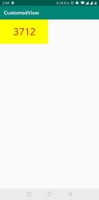
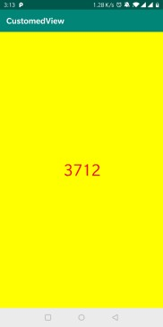

## 自定义view的步骤
1. 自定义View的属性
2. 在View的构造方法中获得自定义属性
3. 重写onMesure方法（非必须的）
4. 重写onDraw方法

### 自定义View的属性
自定义View的属性就是允许在xml中进行配置，类似于Android中自带的各种View一样。

自定义View属性是通过xml文件进行声名的。

在`res/values`下简历attrs.xml，在里面
* 定义属性
* 声明样式

```xml
<?xml version="1.0" encoding="utf-8"?>
<resources>
    <attr name="titleText" format="string"/>
    <attr name="titleTextColor" format="color"/>
    <attr name="titleTextSize" format="dimension"/>

    // format 是该值属性的取值
    // 可能的取值有：string,color,demension,integer,enum,reference,float,boolean,fraction,flag

    <declare-styleable name="CustomTitleView">
        <attr name="titleText"/>
        <attr name="titleTextColor"/>
        <attr name="titleTextSize"/>
    </declare-styleable>
</resources>
```

这里就相当于先声名几个属性`titleText`，`titleTextSize`，`titleTextColor`，再声明类`CustomTitleView`，然后这个类中有几个属性，通过`name`绑定对应的属性。

### 创建对应的类并在构造方法中解析xml文件中的属性
这个名字自然要和上面的声明保持一致，同时，类内部也应该包含与属性声明中对应的属性。
`View`有四个默认的构造方法，可以在有传入的` AttributeSet attrs`中取出定义的属性

```java
public class CustomTitleView extends View {
    private static final String TAG = "CustomTitleView";
    private String mTitleText;
    private int mTitleTextColor;
    private int mTitleTextSize;

    /**
     * 控制文本绘制的范围
     */
    private Rect mBound;
    private Paint mPaint;

    // 注意这里，一定要用this()调用自己刚写的构造函数
    public CustomTitleView(Context context, AttributeSet attrs) {
        this(context, attrs, 0);
    }

    public CustomTitleView(Context context){
        this(context, null);
    }

    /**
     * 获取自定义的属性值，这里的解析方式看来看去，感觉就是，
     ******什么东西都是个int 类型的id
     * @param context
     * @param attrs
     * @param defStyleAttr
     */
    public CustomTitleView(Context context, AttributeSet attrs, int defStyleAttr) {
        super(context, attrs, defStyleAttr);
        // 获取自定义的样式属性，需要解析xml文件
        TypedArray a = context.getTheme().obtainStyledAttributes(attrs, R.styleable.CustomTitleView, defStyleAttr, 0);
        int n = a.getIndexCount();

        for (int i = 0; i < n; i++) {
            int attr = a.getIndex(i);

            switch (attr){
                case R.styleable.CustomTitleView_titleText:
                    mTitleText = a.getString(attr);
                    break;
                case R.styleable.CustomTitleView_titleTextSize:
                    // 默认设置为16sp，TypeValue也可以把sp转化为px
                    mTitleTextSize =  a.getDimensionPixelSize(attr, (int)TypedValue.applyDimension(
                            TypedValue.COMPLEX_UNIT_SP, 16, getResources().getDisplayMetrics()));
                    break;
                case R.styleable.CustomTitleView_titleTextColor:
                    mTitleTextColor = a.getColor(attr, Color.BLACK); // 默认黑色
                    break;
                    default:
                        Log.w(TAG, "解析到不能识别的自定义属性");
            }
        }
        a.recycle();
        /**
         * 获得绘制文本的宽和高
         */
        mPaint = new Paint();
        mPaint.setTextSize(mTitleTextSize);

        mBound = new Rect();
        mPaint.getTextBounds(mTitleText, 0, mTitleText.length(), mBound);
    }
```

### 重写`onDraw`、`onMesure`
```java
@Override
    protected void onMeasure(int widthMeasureSpec, int heightMeasureSpec) {
        super.onMeasure(widthMeasureSpec, heightMeasureSpec);
    }

    @Override
    protected void onDraw(Canvas canvas) {
        mPaint.setColor(Color.YELLOW);
        canvas.drawRect(0, 0, getMeasuredWidth(), getMeasuredHeight(), mPaint);
        mPaint.setColor(mTitleTextColor);
        canvas.drawText(mTitleText, getWidth()/2 - mBound.width()/2, getHeight()/2 + mBound.height()/2, mPaint);
    }
```

### 在layout中声明
可以在加上自己的命名空间

```XML
xmlns:custom="http://schemas.android.com/apk/res/com.example.customedview
```

然后用
```xml
<com.example.customedview.CustomTitleView
                   android:layout_width="200dp"
                   android:layout_height="100dp"
                   custom:titleText="3712"
                   custom:titleTextColor="#ff0000"
                   custom:titleTextSize="40sp"/>
```

或者直接用
```xml
xmlns:app="http://schemas.android.com/apk/res-auto"
```
下面用
```xml
<com.example.customedview.CustomTitleView
                   android:layout_width="200dp"
                   android:layout_height="100dp"
                   app:titleText="3712"
                   app:titleTextColor="#ff0000"
                   app:titleTextSize="40sp"/>
```

### 运行
结果为



当改变`layout_width`、`layout_height`为`wrap_content`后，显示的背景会沾满整个屏幕




程序中的代码为：
```java
mPaint.setColor(Color.YELLOW);
      canvas.drawRect(0, 0, getMeasuredWidth(), getMeasuredHeight(), mPaint);
```
其中`getMeasuredWidth()`和`getMeasuredHeight()`是获得系统测量的结果，系统帮我们测量的高度和宽度都是`MATCH_PARNET`。当明确设置高度和宽度时，系统测量结果就是设置的结果，当设置为`wrap_content`时，或者`MATCH_PARNET`，系统的测量结果时`MATCH_PARNET`的尺寸。

所以需要自己重写`onMeasure`方法。

### 重写`onMeasure`方法
> MeasureSpec的specMode
一共有三种类型：
* ** EXACTLY **:设置了明确的值或者是MATCH_PARENT
* ** AT_MOST **:表示子布局限制在一个最大值内，一般为WARP_CONTENT
* ** UNSPECIFIED **:表示子布局想要多大布局，就多大，使用很少

```java
protected void onMeasure(int widthMeasureSpec, int heightMeasureSpec) {
        int widthMode = MeasureSpec.getMode(widthMeasureSpec);
        int widthSize = MeasureSpec.getSize(widthMeasureSpec);
        int heightMode = MeasureSpec.getMode(heightMeasureSpec);
        int heightSize = MeasureSpec.getSize(heightMeasureSpec);

        int wigth;
        int height;

        if(widthMode == MeasureSpec.EXACTLY){ // 明确指明了,或者就是matchParent
            wigth = widthSize;
        }else{
            // 否则的话，就自己测量
            mPaint.setTextSize(mTitleTextSize);
            mPaint.getTextBounds(mTitleText, 0, mTitleText.length(), mBound);
            float textWidth = mBound.width();
            int desird = (int)(getPaddingLeft() + textWidth + getPaddingRight());
            wigth = desird;
        }

        if(heightMode == MeasureSpec.EXACTLY){ // 明确指明了,或者就是matchParent
            height = heightSize;
        }else{
            // 否则的话，就自己测量
            mPaint.setTextSize(mTitleTextSize);
            mPaint.getTextBounds(mTitleText, 0, mTitleText.length(), mBound);
            float textHeight = mBound.height();
            int desird = (int)(getPaddingTop() + textHeight + getPaddingBottom());
            height = desird;
        }

        setMeasuredDimension(wigth,height);
    }
```
也就是说，根据他的模式，来给出数值，如果模式是`EXACTLY `，那就表示属性的值就是指定的大小或者是`MATCH_PARNET`,就直接用他的就好，如果是另外的，那就需要自己去计算。
