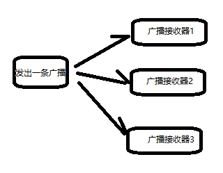
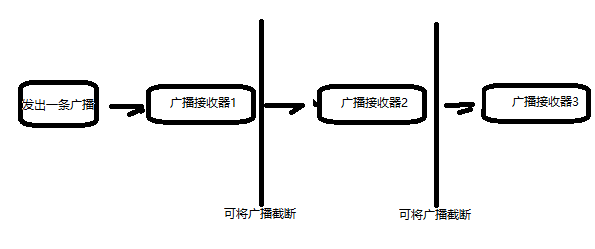

# 一、Activity

# 二、Brodcast
Android提供的一套完整的API，允许应用程序发送和接受系统或其他应用的广播消息。感觉就是进程间通信的一种机制。

每个应用程序自己对感兴趣的时间进行注册订阅。

Android中的广播分为两种类型：
>* **标准广播**:是一种异步广播一条广播发出后，所有的广播接收器几乎会在同一时间接收到这条广播消息，他们之间不存在先后关系或优先级顺序。所以无法被截断。

>* **有序广播**：是一种同步广播，广播发出后，同一时刻只有一个广播接收器会受到该条广播消息，当这个广播接收器中的逻辑执行完成后，在传递给下一个。
广播接收器有先后顺序，优先级高的先收到，并且可以截断消息。


两种注册方式：
> * **动态注册**：代码中注册。要求程序运行才能起作用。优点在于：可以自由控制注册与注销，灵活；缺点是：程序必须启动才能接收广播，因为注册逻辑写在onCreat()方法中。比方开机广播，就接受不到。
* **静态注册**：在Androidmanifest中注册。

### 接受系统广播
Android内置系统广播：包括不限于
- 手机开机
- 电量变化
- 时间或区域发生改变

#### 动态注册监听网络变化
> **接收器的创建方式**：
>
 >1. 创建类，继承BroadcastReceiver  
 >2. 重写父类onRecive9()方法，在该方法中写处理逻辑。
 >3. 在活动的onCreat()方法中创建intentFilter，addAction，然后将继承自BroadcastReceiver类的实例和intentFilter一起作为参数注册（逻辑较为简单，intntFilter指明要听什么消息，自己写的类写明接到消息后干什么。）
（有些类似于intent启动其他活动的用法，当时intent的银式使用课题在activity中配置自己可以响应什么事件，通过标签<intent-filter>，动态的intent是创建要产生的事件）


``` java
public class MainActivity extends AppCompatActivity {
    private IntentFilter intentFilter;
    private NetWorkChangeReceiver receiver;

    @Override
    protected void onCreate(Bundle savedInstanceState) {
        super.onCreate(savedInstanceState);
        setContentView(R.layout.activity_main);
        intentFilter = new IntentFilter();
        intentFilter.addAction("android.net.conn.CONNECTIVITY_CHANGE");
        receiver = new NetWorkChangeReceiver();
        registerReceiver(receiver, intentFilter);
    }

    class NetWorkChangeReceiver extends BroadcastReceiver{
        @Override
        public void onReceive(Context context, Intent intent) {
            ConnectivityManager connectivityManager = (ConnectivityManager) getSystemService(Context.CONNECTIVITY_SERVICE);
            NetworkInfo networkInfo = connectivityManager.getActiveNetworkInfo(); // 这里需要用户权限，要在配置文件中配置
            if (networkInfo != null && networkInfo.isAvailable()){
                Toast.makeText(context, "network is available", Toast.LENGTH_SHORT).show();
            }else{
                Toast.makeText(context, "network  is uiavilable", Toast.LENGTH_SHORT).show();
            }
        }
    }
}

```
在AndroidManifest.xml中加权限
``` XML
<uses-permission android:name="android.permission.ACCESS_NETWORK_STATE"/>
```
#### 静态注册实现开机启动
>**创建方式：**
>1. new -> other -> BroadcastReceiver
>2. 重写onReceive
>3. 在AndroidManifest.xml中<receiver>标签中注册

### 发送自定义广播
（广播其实就是给个action，通过这个action来区别的，就像每个消息有个key，上面的"android.net.conn.CONNECTIVITY_CHANGE"就是一种key，所以自定义就是自定义一个action的key）

#### 发送标准广播
> **创建方式 **
> 1. 先创建一个接受者，无论动态还是静态，都一定会有
```
IntentFilter.addAction()
```
>或者
```
 <intent - filter>
  <action ...>
 </intent - filter>
```
>这里面会指定一个action，就是一个字符串(很关键)
> 2. new一个Intent，通过构造函数传进action的名字（那个字符串），然后send(intent) ,intent可以传递数据。

**接收不到解决：**
* 加参数：
``` java
intent.setComponent(new ComponentName("com.example.broadcaststudy",
                        "com.example.broadcaststudy.MyBroadcastReciver"));
```
* 用动态代替静态

#### 发送有序广播
把sendBroadcast()方法换成sendOrderedBroadcast(intent, <权限相关字符串，传null可行>)即可。在intent-filter中可以设置优先级，在onReceive()方法中可以拦截丢弃。

### 使用本地广播
**本地广播对比系统全局广播：**
- 系统全局广播可以被其他任何应用程序接收到，并且可以接受来自其他任何应用的广播，因此容易引起安全性问题
- 本地广播发出的广播只会在应用程序内部传递，并且只接受来自本应用的广播。
- 本地广播无法通过静态注册的方式实现。
- 本地广播较高效


# 三、Providers
# 四、Service
