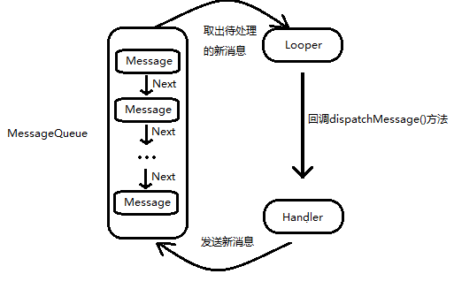

# 一、Activity
Activity表示具有用户界面的单一屏幕。每个Activity都独立于其他Activity单独存在。
# 二、Brodcast
Android提供的一套完整的API，允许应用程序发送和接受系统或其他应用的广播消息。感觉就是进程间通信的一种机制。

每个应用程序自己对感兴趣的时间进行注册订阅。

Android中的广播分为两种类型：
>* **标准广播**:是一种异步广播一条广播发出后，所有的广播接收器几乎会在同一时间接收到这条广播消息，他们之间不存在先后关系或优先级顺序。所以无法被截断。

>* **有序广播**：是一种同步广播，广播发出后，同一时刻只有一个广播接收器会受到该条广播消息，当这个广播接收器中的逻辑执行完成后，在传递给下一个。
广播接收器有先后顺序，优先级高的先收到，并且可以截断消息。


两种注册方式：
> * **动态注册**：代码中注册。要求程序运行才能起作用。优点在于：可以自由控制注册与注销，灵活；缺点是：程序必须启动才能接收广播，因为注册逻辑写在onCreat()方法中。比方开机广播，就接受不到。
* **静态注册**：在Androidmanifest中注册。

### 接受系统广播
Android内置系统广播：包括不限于
- 手机开机
- 电量变化
- 时间或区域发生改变

#### 动态注册监听网络变化
> **接收器的创建方式**：
>
 >1. 创建类，继承BroadcastReceiver  
 >2. 重写父类onRecive9()方法，在该方法中写处理逻辑。
 >3. 在活动的onCreat()方法中创建intentFilter，addAction，然后将继承自BroadcastReceiver类的实例和intentFilter一起作为参数注册（逻辑较为简单，intntFilter指明要听什么消息，自己写的类写明接到消息后干什么。）
（有些类似于intent启动其他活动的用法，当时intent的银式使用课题在activity中配置自己可以响应什么事件，通过标签<intent-filter>，动态的intent是创建要产生的事件）


``` java
public class MainActivity extends AppCompatActivity {
    private IntentFilter intentFilter;
    private NetWorkChangeReceiver receiver;

    @Override
    protected void onCreate(Bundle savedInstanceState) {
        super.onCreate(savedInstanceState);
        setContentView(R.layout.activity_main);
        intentFilter = new IntentFilter();
        intentFilter.addAction("android.net.conn.CONNECTIVITY_CHANGE");
        receiver = new NetWorkChangeReceiver();
        registerReceiver(receiver, intentFilter);
    }

    class NetWorkChangeReceiver extends BroadcastReceiver{
        @Override
        public void onReceive(Context context, Intent intent) {
            ConnectivityManager connectivityManager = (ConnectivityManager) getSystemService(Context.CONNECTIVITY_SERVICE);
            NetworkInfo networkInfo = connectivityManager.getActiveNetworkInfo(); // 这里需要用户权限，要在配置文件中配置
            if (networkInfo != null && networkInfo.isAvailable()){
                Toast.makeText(context, "network is available", Toast.LENGTH_SHORT).show();
            }else{
                Toast.makeText(context, "network  is uiavilable", Toast.LENGTH_SHORT).show();
            }
        }
    }
}

```
在AndroidManifest.xml中加权限
``` XML
<uses-permission android:name="android.permission.ACCESS_NETWORK_STATE"/>
```
#### 静态注册实现开机启动
>**创建方式**：
>1. new -> other -> BroadcastReceiver
>2. 重写onReceive
>3. 在AndroidManifest.xml中<receiver>标签中注册

### 发送自定义广播
（广播其实就是给个action，通过这个action来区别的，就像每个消息有个key，上面的"android.net.conn.CONNECTIVITY_CHANGE"就是一种key，所以自定义就是自定义一个action的key）

#### 发送标准广播
> **创建方式**
> 1. 先创建一个接受者，无论动态还是静态，都一定会有
```
IntentFilter.addAction()
```
>或者
```
 <intent - filter>
  <action ...>
 </intent - filter>
```
>这里面会指定一个action，就是一个字符串(很关键)
> 2. new一个Intent，通过构造函数传进action的名字（那个字符串），然后send(intent) ,intent可以传递数据。

**接收不到解决：**
* 加参数：
``` java
intent.setComponent(new ComponentName("com.example.broadcaststudy",
                        "com.example.broadcaststudy.MyBroadcastReciver"));
```
* 用动态代替静态

#### 发送有序广播
把sendBroadcast()方法换成sendOrderedBroadcast(intent, <权限相关字符串，传null可行>)即可。在intent-filter中可以设置优先级，在onReceive()方法中可以拦截丢弃。

### 使用本地广播
**本地广播对比系统全局广播：**
- 系统全局广播可以被其他任何应用程序接收到，并且可以接受来自其他任何应用的广播，因此容易引起安全性问题
- 本地广播发出的广播只会在应用程序内部传递，并且只接受来自本应用的广播。
- 本地广播无法通过静态注册的方式实现。
- 本地广播较高效


# 三、Providers
> 跨程序共享数据。提供了完整机制，允许一个程序访问另一个程序中的数据，同时还能保证数据的安全性。

> 与SharedPreferences相比:不同于SPf中的两种全局可读可写操作模式，内容提供器可以选择对哪一部分数据进行共享，从而保证隐私数据不会泄露

### 运行时权限
在Androidmanifest中加入<user-permission/>后，低于Android 6.0的手机在安装时，会提示相关权限申请，拒绝则不安装，不决绝则安装，所以存在滥用权限的情况。

Android 6.0之后加入运行时权限，在运行过程中申请，拒绝也不会影响其他功能的使用。

Android将所有权限分为两类：
* 普通权限：不会直接威胁到用户的安全和隐私的权限，系统会自动进行授权
* 危险权限：可能会触及用户隐私或者对设备安全性造成影响的权限，如获取联系人信息，定位设备的地理位置等，这部分必须由用户自己手动点击授权才可以。

危险权限：

权限组名 | 权限名
------------ | -------------
CaLENDAR|READ_CALENDAR 、WRITE_CALENDAR
CAMEAR | CAMERA
CONTACTS |READ_CONTECTS 、WRITE_CONTACTS
...|...

(用到时，查表)在进行权限处理时，使用的是权限名，但是用户一旦同意授权了，那么该权限所对应的权限组中所有的其他权限也会同时被授权。

#### 运行时申请权限
还是通过Intent，所以总体来说，在活动或者界面之间穿来穿去，都可以用intent:
* 活动之间切换用显式intent
* broadcast也是活动之间或者进程之间通信，也必须用IntentFilter去作为接收的参数，发送广播也要用send(intent)

Intent里面比较重要的就是构造函数中的Action参数，指定传输的目的地！Intent还可以当做数据容器传递数据。

### 访问其他程序中的数据
> 使用方法有两种：
* 使用现有的内容提供器来读取和操作相应程序中的数据
* 创建自己的内容提供器给程序的数据提供外部访问接口

如果一个应用程序通过内容提供器对其数据提供了外部访问接口，那么任何其他应用程序就都可以使用这部分数据进行访问。Android中自带的电话薄、短信、媒体等程序都提供了类似的访问接口，这就使得第三方应用程序可以充分地利用这部分数据来实现更好的功能。

#### ContentResolver的基本用法

*如果一个应用程序想访问内容提供器中共享的数据，就一定要借助ContentResolver类。*

ContentResolver提供了一系列方法用于对数据进行CRUD操作，ContentResolver中的增删改查方法**不接收表名**，而是**用Uri代替**，该参数称为URI，对数据建立唯一标识符，主要有两部分构成：
* authority : 用于区分不同程序
* path ： 对同一应用程序中的不同表做区分，通常会添加到authority后面。

URI内容最标准的写法<协议名://authority/path>：
```
content://com.example.app.provider/table1
```
在得到内容URI字符串后，还需要将他解析成Uri对象才能传入，解析方法为：
```java
Uri uri = Uri.parse("content://com.example.app.provider/table1");
```
然后查询：
``` java
Cursor cursor = getContentResolver().query(
uri,
projection,
selection,
selectionArgs,
sortOrder);
```
和SQLiteDatabase中的query方法对比：

| query()方法参数 | 对应SQL部分     | 描述
| :------------- | :------------- | :-------------
| uri       | from table_name     | 指定查询某个应用程序下的某一张表
| projection|select column1, column2| 指定查询的列名
|selection  | where column = value  | 指定where的约束条件
|selectionArgs |- |为where重的占位符提供具体的值
|orderBy|order by column1, column2 | 指定查询结果的排序方式

查询完成后返回的时一个Cursor对象，逐个读取：

```java
if(cursor != null){
    while(cursor.moveToNext()){
        String column1 = cursor.getString(cursor.getColumnIndex("column1"));
        int column2 = cursor.getInt(cursor.getColumnIndex("column2"));
    }
}
```

增加数据：

```java
ContentValues values = new ContentValues();
values.put("column1", "text");
values.put("column2", 1);
getContentResolver().insert(uri, values);
```

更新数据：

```java
ContentValues values = new ContentValues();
values.put("column1", "");
getContentResolver().update(uri,  
                            values,
                            "column1 = ? and colmun2 = ?",
                            new String[]{"text", "1"});
```

删除：

```java
getContentResolver().delete(uri, "column1 = ? , new String[]{"text"});
```

#### 创建自己的内容提供器：

###### 创建内容提供器的步骤
方式：新建一个类去继承ContentProvider，实现里面的方法，就是对外提供的接口实现。

除了标准的URI之外，还要一种后面带一个id
```String
content://com.example.app.provider/table1/1
```
表示期望访问的是com.example.app.provider这哥应用的table1中id为1的数据。**以路径结尾表示要访问表中的所有数据，以id访问表示期望表中拥有相应id的数据**，可以使用通配符的方式来分配这两种格式内容URI:

- *：表示匹配任意长度的任意字符
- #：表示匹配任意长度的数字

一个能够匹配任意表内容的URI:
```String
content://com.example.app.provider/*
```
一个能够匹配table1表中任意一行数据内容URI：
```String
content://com.example.app.provider/table1/#
```

可以借助URIMatch这个类轻松匹配内容URI的功能。

```java
public class MyProvider extends ContentProvider {

    public static final int TABLE1_DIR = 0;
    public static final int TABLE1_ITEM = 1;
    public static final int TABLE2_DIR = 2;
    public static final int TABLE2_ITEM = 3;

    private static UriMatcher uriMatcher;

    static {
        uriMatcher = new UriMatcher(UriMatcher.NO_MATCH);
        uriMatcher.addURI("com.example.runtimepermissiontest.provider",
                "table1", TABLE1_DIR);
        uriMatcher.addURI("com.example.runtimepermissiontest.provider",
                "table1", TABLE1_ITEM);
        uriMatcher.addURI("com.example.runtimepermissiontest.provider",
                "table2", TABLE2_DIR);
        uriMatcher.addURI("com.example.runtimepermissiontest.provider",
                "table2", TABLE2_ITEM);
    }

    /**
     * 当ContentResolver尝试访问当前程序数据时，内容提供器被初始化，此时会调用该函数
     * 通常在这里完成度数据库的创建和升级操作
     * 返回true表示内容提供器初始化成功，返回false表示失败
     */
    @Override
    public boolean onCreate() {
        return false;
    }


    @Override
    public Cursor query( Uri uri,  String[] projection, String selection,  String[] selectionArgs,  String sortOrder) {
        switch (uriMatcher.match(uri)){
            case TABLE1_DIR:
                // 查询table1中的内容
                break;
            case TABLE1_ITEM:
                //查询table1中的单条内容
                break;
            case TABLE2_DIR:
                // 查询table2中的内容
                break;
            case TABLE2_ITEM:
                // 查询table2中的单条内容
                break;
            default:
                break;
        }
        return null;
    }

    /**
     * 根据传入的内容URI来返回相应的MIME类型
     * 是一种固定格式
     */
    @Override
    public String getType(Uri uri) {
        switch (uriMatcher.match(uri)){
            case TABLE1_DIR:
                return "vnd.android.cursor.dir/vnd.com.example.runtimepermissiontest.provider.table1";
            case TABLE1_ITEM:
                return "vnd.android.cursor.item/vnd.com.example.runtimepermissiontest.provider.table1";
            case TABLE2_DIR:
                return "vnd.android.cursor.dir/vnd.com.example.runtimepermissiontest.provider.table2";
            case TABLE2_ITEM:
                return "vnd.android.cursor.item/vnd.com.example.runtimepermissiontest.provider.table2";
            default:
                break;
        }
        return null;
    }

    @Override
    public Uri insert( Uri uri,  ContentValues values) {
        return null;
    }

    @Override
    public int delete( Uri uri,  String selection,  String[] selectionArgs) {
        return 0;
    }

    @Override
    public int update( Uri uri, ContentValues values,  String selection, String[] selectionArgs) {
        return 0;
    }
}
```

> 关于getTypoe()方法用于获取Uri对象所对应的MIME类型：
* 一个内容URI所对应的MIME字符串主要由3部分组成
* 必须以 vnd 开头
* 如果内容URI以路径结尾，则后接android.cursor.dir/，如果内容URI以id结尾，则后接android.cursor.item/。
* 最后接上 vnd.<authority\>.<path\>


# 四、Service

> 服务是android中实现程序后台运行的解决方案
* 适合执行不需要和用户交互而且还要求长期运行的任务
* 服务不依赖于任何用户界面，及时程序被切换到后台，或者用户开启另外一个应用程序，服务仍然可以正常运行。
* 服务并不运行在一个独立的进程中，而是依赖于创建服务时所在的应用程序进程。当某个应用程序被杀掉时，所有依赖于该进程的服务也会停掉。
* 服务不会开启线程，默认运行在主线程当中。

### android中的线程
Android程序中的主线程用于加载UI，所以也叫UI线程，在其他子线程中不能更改UI，否则会报错，有下面几个原则：
* 决不能在UI Thread当中进行耗时操作，不能阻塞UI Thread
* 不能在UI Thread之外的线程当中操作UI元素

##### 异步处理机制-线程池、消息队列
异步消息处理主要会用到四个组件：
* Message :线程之间传递的消息，内部携带少量信息，用于在不同线程之间交换数据，包含以下几个字段
    * what：
    * arg1：携带整型数据
    * arg2：携带整型数据
    * obj：携带一个Object对象（地址？）
* Handler：发送和处理消息，使用Handler的sendMessage()方法，发出的消息通过一系列处理后，最终会回到该对象的handleMessage()方法中。（也就是，每个任务有一个该对象的实例，不同handler对象有自己的上下文，有状态变量）
* MessageQueue :消息队列，主要用于存放所有通过Handler发送的消息。**每个线程中只会有一个MessageQueue对象**
* Looper：调用loop()方法后，轮询Message，如果有就取出来，通过dispatchMessage()分发给Handler处理（上面说，每个线程只有一个MessageQueue对象，所以在一个线程中，实例化多个handler对象，sendMessage()后的消息都在同一个消息队列中，所以这里从取出消息到把消息分发给Handler过程中是有一个路由的过程的）


然后最后指定调用的时候，已经进入到了主线程。

``` java
public class MainActivity extends AppCompatActivity implements View.OnClickListener{
    public static final int UPDATE_TEXT = 1;

    private TextView textView = null;

    private Handler handler = new Handler(){
        @Override
        public void handleMessage(Message msg) {
            switch (msg.what){
                case UPDATE_TEXT:
                    textView.setText("nice !");
                    break;
                    default:
                        break;
            }
        }
    };
    @Override
    protected void onCreate(Bundle savedInstanceState) {
        super.onCreate(savedInstanceState);
        setContentView(R.layout.activity_main);

        textView = findViewById(R.id.text_view);
        Button button = findViewById(R.id.btn_change_textview_content);
        button.setOnClickListener(this);
    }

    @Override
    public void onClick(View v) {
        switch (v.getId()){
            case R.id.btn_change_textview_content:
                new Thread(new Runnable() {
                    @Override
                    public void run() {
                        Message message = new Message();
                        message.what = UPDATE_TEXT;
                        System.out.println("send message");
                        handler.sendMessage(message);
                        System.out.println("send message done");
                        try {
                            Thread.sleep(3000);
                        } catch (InterruptedException e) {
                            e.printStackTrace();
                        }

                        System.out.println("sleep done");
                    }
                }).start();
                break;
            default:
                break;
        }
    }
}
```
通过验证可以看出，是异步执行的，在handler.sendMessage(message);方法执行后，当前线程直接返回。源码里面有一处是更改的message对象的属性

```java
private boolean enqueueMessage(MessageQueue queue, Message msg, long uptimeMillis) {
    msg.target = this;// 后面从这里可以找到发送消息的对象，从而找到对应的处理逻辑
    if (mAsynchronous) {
        msg.setAsynchronous(true);
    }
    return queue.enqueueMessage(msg, uptimeMillis);
}
```


##### 异步任务框架AsyncTask
> 使用方式：AsyncTask是一个抽象类，所以使用时创建一个子类继承它，在继承时，可以指定三个泛型参数：
* **params** :在执行AsyncTask时需要传入的参数，可用于后台任务中使用
* **Progress** :后台执行任务时，如果需要在界面上显示当前进度，则使用这个泛型指定的泛型为进度单位。
* **Result** : 当任务执行完毕后，如果需要对结果进行返回，则使用这里指定的泛型作为返回值类型。

创建方式：
```java
public class DownloadTask extends AsyncTask<Void, Integer, Boolean> {

    //这个方法会在后台任务开始执行之前调用，用于进行一些界面上的初始化操作，比如显示一个进度条对话框
    @Override
    protected void onPreExecute() { super.onPreExecute(); }

    //该方法中的所有代码都在子线程中执行，应该在这里处理所有的耗时任务,一旦完成任务，可以通过return返回执行结果，
    @Override// 这个方法不能进行UI操作,如果需要，可以调用publishProgress(Prosess...)方法完成
    protected Boolean doInBackground(Void... voids) {return null;}
    //当后台任务中调用了publishProgress(Progress...)方法后，还方法会被调用，参数就是后台任务传递过来的，可以对UI进行操作。
    @Override
    protected void onProgressUpdate(Integer... values) { super.onProgressUpdate(values); }
    //当后台任务执行完毕并通过return语句进行返回时，这个方法就会很快得到调用，返回的数据作为参数传递到此方法中，可以利用返回的数据来进行
    // 一些UI操作
    @Override
    protected void onPostExecute(Boolean aBoolean) {super.onPostExecute(aBoolean);  }
    @Override
    protected void onCancelled(Boolean aBoolean) { super.onCancelled(aBoolean); }

    @Override
    protected void onCancelled() {super.onCancelled(); }
}
```
### 服务的基本用法
1. 首先定义一个服务，通过继承Service抽象类。
2. 启动和停止服务，主要是借助Intent来实现。
```java
case R.id.btn_start_service:
        Intent startIntent = new Intent(this, MyService.class);
        startService(startIntent);
        break;
case R.id.btn_stop_service:
        Intent stopIntent = new Intent(this, MyService.class);
        stopService(stopIntent);
        break;
```
(都是Intent(this, ...class)，活动的切换也是这样)

##### 活动和服务进行通信
让活动和服务关系更加紧密，例如在活动中指挥服务干什么。借助onBind()方法。
1. 在该方法中，返回一个IBinder类子类的实例，而这个子类的实例定义在服务中。
```java
    class DownloadBinder extends Binder{
        public void startDownload(){
            Log.d("MyService", "startDownload");
        }

        public int getProgress(){
            Log.d("MyService", "getProgress");
            return 0;
        }
    }
    @Override
    public IBinder onBind(Intent intent) {
        return mBinder;
    }
```
2. 在活动中创建ServiceConnection的实例，要求实现两个方法：
```java
private ServiceConnection connection = new ServiceConnection() {
        @Override
        public void onServiceConnected(ComponentName name, IBinder service) {
            downloadBinder = (MyService.DownloadBinder) service;
            downloadBinder.startDownload();
            downloadBinder.getProgress();
        }

        @Override
        public void onServiceDisconnected(ComponentName name) {

        }
    };
```

3. 在onServiceConnected方法中，可以取出IBinder的实例，并通过该实例调用方法。
4. 链接到一起：
```java
Intent bindIntent = new Intent(this, MyService.class);
                bindService(bindIntent, connection, BIND_AUTO_CREATE); //绑定服务
                break;
 ```

 **任何一个服务在整个程序范围内都是通用的，即MyService不仅可以和MainActivity绑定，还可以和热河一个其他活动绑定，并且绑定后，都可以获得相同的DownloadBuinder实例**

### 服务的生命周期

1. 任何位置调用了Context的startService()方法，相应的服务就会启动起来，并回调onCreatCommand()方法。如果这个服务之前没有被创建过，onCreate()方法会先于onStartCommand()方法执行。服务启动后会一直保持运行状态，知道stopService()方法或stopSelf()方法被调用。虽然每调用一次startService()，onStartCommand()就会被执行一次，但是实际上每个服务都只会存在一个实例。所以无论调用多少次startService()方法，只需要调用一次stopService()或stopSelf()方法，服务就会停止。
2. 还可以调用Context的bindService()方法来获取一个服务的持久连接，这时就会回调服务中的onBind()方法。如果服务没有被创建过，还是会优先调用onCreate()方法，再调用onCreate()方法。之后，调用方可以捕获到onBind()方法中返回的IBinder对象的实例，这样就能自由地和服务通信了。
3. 调用了startService()方法后，再调用stopService()方法，这时服务中的onDestroy()方法就会被执行，表示服务被撤销了。类似的，调用bindService()后，又调用unbindService()，服务也会被撤销。
**一个服务只要被启动或者被绑定后，就会一直处于运行状态，必须要让以上两个条件同时不满足，服务才能销毁**，所以如果两种启动方式对同一个服务调用，那么关闭时，也要调用两个关闭方法。
