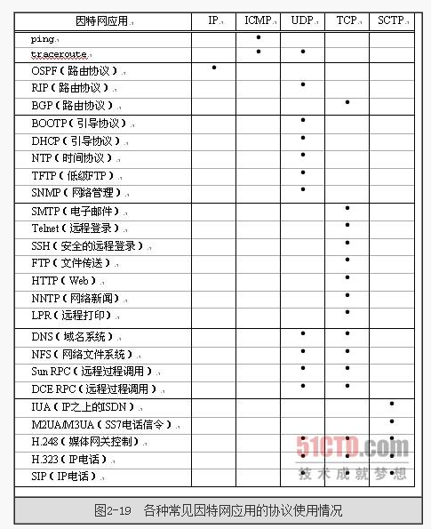

# 一、OSI参考模型
OSI模型是一个通信协议设计标准，有些类似于程序设计中的模块化开发。将一个复杂的功能做了横向划分，每个层可以使用它下一层的服务，同时为它的上一层提供服务。

通过分层，将复杂的网络进行简化，每层仅需实现该层所关注的功能即可，相邻两层之间通过约定好的方式（接口）进行交互，这样的话，每层的功能清晰，具体实现方式又对其他层透明，相对独立，即使系统中的某些分层发生变化，也不会波及整个系统。因此，可以构建一个扩展性和灵活性都比较强的系统。

OSI参考模型自下而上分为：

| 分层 | 分层名称    | 功能| 概况|工作设备|
| :------------- | :------------- |:------------- |:------------- |
| 7       | 应用层    | 针对特定应用的协议，比如Http、FTP、SMTP |为应用程序提供服务并规定应用程序中通信相关细节。电子邮件（用电子邮件协议）、文件服务（用文件传输协议）| 电脑上的应用进程|
| 6       | 表示层    | 设备固有数据格式于网络标准数据格式的转换 | 从上层接受不同表现形式的信息，如文字、图像、声音等，转换为标准的数据格式给下层用，或者反过来。不同设备对同一比特流解释的结果可能会不同，该层就是要让他们保持一致。| |
| 5       | 会话层    |通信管理。两个节点之间，建立、维护和断开通信连接（数据流动的逻辑通路）， 控制和管理| 何时建立、何时断开、保持多久连接| |
| 4       | 传输层    |保证两个节点之间的可靠传输 | 数据差错控制等等，只在通信双方节点上进行处理，而无需再路由器上处理。TCP、UDP就只在这一层了 | |
| 3       | 网络层    |地址管理、路由选择 |考虑怎么把数据送到某个地方，不考虑差错等等|路由器|
| 2       | 数据链路层    |直接互连的设备之间数据的传送，通过数据帧的形式（MAC地址识别） |负责物理层面上的互连的、节点之间的通信传输；将0/1序列划分为具有意义的数据帧传送给对端|网卡、网桥、交换机|
| 1       | 物理层    | 以“0”“1”代表电压高低、灯光的闪灭，界定连接器和网线的规格 |比特流和电子信号（光信号）之间的转换|中继器、集线器|

* mac地址与IP地址：mac地址是网卡厂商烧录在网卡内部只读存储器上的唯一标识，不可更改；IP是当节点介入互联网时，由运营商分配给的一个网络地址。
* 中继器：物理层的双绞线传输距离有限，信号会缩减，影响数据的传输，中继器可以放大传输信号，保持元数据的准确。
* 集线器：相当于多个端口的中继器。
* 网桥：将两个LAN链接在一起，变成一个LAN，然后按照MAC地址转发，分离冲突域。
* 交换机：和网桥类似，交换机端口多。网桥基于软件转发，交换机基于硬件转发，可以通过命令查看Mac地址表，网桥不行，交换机造价比网桥低。

数据流动过程中的图解：

TCP/IP采用的时五层模型：

# 三次握手及四次挥手
TCP协议是面向连接的协议，当两个节点之间要传送数据时，首先需要建立一条链接，而链接建立使用的就是三次握手的方式，当连接建立成功后，这两个节点之间的数据收发均通过这条链路进行，直至数据发送完毕，连接断开，连接断开时通过四次挥手过程。

## 三次握手
三次握手发生在连接建立过程中，可以将主动发起连接的一方称为客户端（client），对端称为服务器端（server），cilent发起请求，想要和server端进行通信。

1. 第一次握手：client发送一个TCP的SYN标志为1的包，表示这是一个连接建立请求报文，以及初始的包序号x。（图中红圈圈住的 1 的位置就是SYN标志位，这个标志位右边的标志位时FIN，是在连接释放阶段用的）

2. 第二次握手：服务器发送连接建立请求确认（就是确认客户端的连接建立请求，让ACK=1）。里面也包含连接建立请求（也是双工模式的一种体现吧），所以SYN标志位为1。另外，还需要返回序号确认，Acknowledgement Number（用Ack表示）置为客户的seq加1，即x+1。最后，加上自己的序号y。

3. 第三次握手：客户端发送连接建立请求确认（同上，让ACK标志位为1），此包就不再是连接建立请求了，所以syn标志位置0，并返回序号确认，让Ack=y+1。

## 四次挥手

报文中各个数据的位置可以看上面三次握手的图。

## 三次握手及四次挥手中的一些问题
1. 建立连接为什么三次？不能两次？不需要四次？关闭连接需要四次？
因为服务端处于listen状态时，收到连接建立请求（SYN=1），可以把ACK和SYN放在一个报文中发送回去。但是关闭连接时，因为TCP全双工，接收到对方FIN报文时，仅仅代表对方没有数据再发送过来，而并不表示本端没有数据要发给对方，对方此时仍然可以接收数据，所以ACK和FIN分开发送。

2. 为什么TIME_WAIT状态还需要等2MSL之后才能进入Closed状态？
MSL即Maximum Segment Lifetime，也就是报文最大生存时间，表示“任何报文段被丢弃在网络内的最长时间”，作用有两个，一是保证ACK会成功发送到对方，二是防止紧接着的同一个client端口到同一个server端口的TCP连接建立后，有上一个连接的报文混淆进来。

## 协议的选择使用

