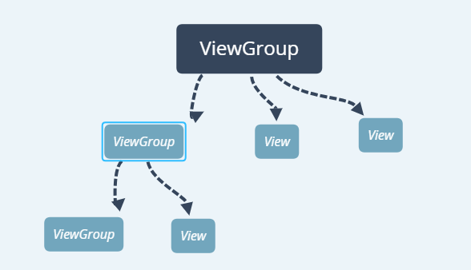
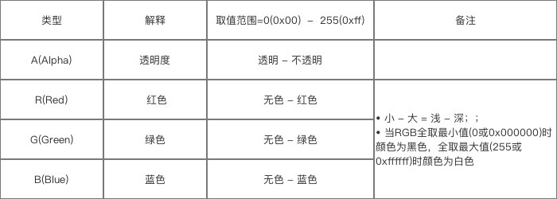

# 自定义View基础
参考[简书](https://www.jianshu.com/p/53759778284a)文档：
## View的分类
* 单一视图：一个View，例如TextView，特点是不包含子View
* 视图组：多个View组成的ViewGroup，如LinearLayout，特点是包含子View
## View类简介
* View类是android中各组件的基类
* View表现为显示在屏幕上的各种视图，Android中的UI组件都由View、ViewGroup组成
* View有四个构造函数，自定义View时至少实现一个。
```java
/**
   * 当从代码创建时，使用这个构造函数
   * @param context 当前View运行的上下文环境，通过这个上下文，可以访问当前的主题， resources, etc.
   */
  public View(Context context) {
      mContext = context;
      ...
  }

  /**
 * Constructor that is called when inflating a view from XML. This is called
 * when a view is being constructed from an XML file, supplying attributes
 * that were specified in the XML file. This version uses a default style of
 * 0, so the only attribute values applied are those in the Context's Theme
 * and the given AttributeSet.
 *
 * <p>
 * The method onFinishInflate() will be called after all children have been
 * added.
 *
 * @param context The Context the view is running in, through which it can
 *        access the current theme, resources, etc.
 * @param attrs The attributes of the XML tag that is inflating the view.
 * @see #View(Context, AttributeSet, int)
 */
public View(Context context, @Nullable AttributeSet attrs) {
    this(context, attrs, 0);
}

public View(Context context, @Nullable AttributeSet attrs, int defStyleAttr) {
    this(context, attrs, defStyleAttr, 0);
}
// 从xml，可以增加一些属性
public View(Context context, @Nullable AttributeSet attrs, int defStyleAttr, int defStyleRes) {}
```

> 各参数的意义（除了Context，其他参数只能通过xml属性配置View的出事状态，布局、style、theme）：
* Contex上下文
* attributeSet - XML属性，当从XML inflate的时候用到
* int defStyleArttr - 应用到View的默认风格
* int defStyleResource - 如果没有使用defStyleAttr，应用到View的默认风格

## view的视图结构-树形
对于多View的视图，结构是树形结构：最顶层是ViewGroup，ViewGroup下可能有多个ViewGroup或View。


**无论是measure过程、layout过程还是draw过程，永远都是从View树的根节点开始测量或计算，一层一层、一个分支一个分支的进行（即递归）**，最终计算整个View树种的各个View，最终确定整个View树的相关树形。

## 坐标系
> 定义为：
* 屏幕的左上角为坐标原点
* 向右为x增大的方向
* 向下问y增大的方向

> 子view的定位
* top：子view上边界到父View上边界的距离
* left：....左............左........
...

## 位置获取方式
* View的位置通过view.getxxx()函数获取：getTop()、getLeft()、getBottom()、getRight()
* 与MotionEvent中区别：
```java
event.getX(); // 触点相对于组件的坐标
event.getY();

event.getRawX();// 触点相对于屏幕默认坐标系的坐标
event.getRawY();
```

## 角度与弧度
* 默认顺时针为角度增大方向

## 颜色
### 颜色模式



### 颜色的定义
各种颜色的数值定义都类似，就是定义方式的区别，可以在xml中定义，可以在代码中用`Color`类定义。
```java
//java中使用Color类定义颜色
int color = Color.GRAY;     //灰色
 //Color类是使用ARGB值进行表示
 int color = Color.argb(127, 255, 0, 0);   //半透明红色
 int color = 0xaaff0000;                   //带有透明度的红色
```
在xml中定义的话，可以放在values文件夹下
```xml
<?xml version="1.0" encoding="utf-8"?>
<resources>
    <color name="mycolor_red">#f00</color>
</resources>
```
数值代表着颜色，有以下几种格式：
```
#f00            //低精度 - 不带透明通道红色
#af00           //低精度 - 带透明通道红色

#ff0000         //高精度 - 不带透明通道红色
#aaff0000       //高精度 - 带透明通道红色
```

### 引用颜色
如果在代码中引用xml中定义的颜色
```java
int color = getResources().getColor(R.color.mycolor_red);
```
在xml中要引用
```xml
        android:background="@color/mycolor_red"
```
# 自定义View Measure过程
分为单一View和ViewGroup，作用是确定View的大小（MeasureWidth和MeasureHeight）

# 自定义View Layout过程
分为单一View和ViewGroup，作用就是确定位置，如果自定义ViewGroup，那么子View的排布就可以重写onLayout()方法实现，比如LinearLayout的竖直模式下，通过一个topxxx的一个变量，保存下一个子View上边缘开始的位置，而每次计算一个子View的高度，就让这个值加上刚刚计算的子View的高度，从而实现位置的下移。
# 自定义View Draw过程
主要还是在onDraw()方法里面。绘制逻辑。在drwa()时，要layout，而layot又会调用getMeasureWidth()和getMeasureHeight()方法，进而确定位置，确定大小，然后再调用onDraw()，实现具体的绘画逻辑。
