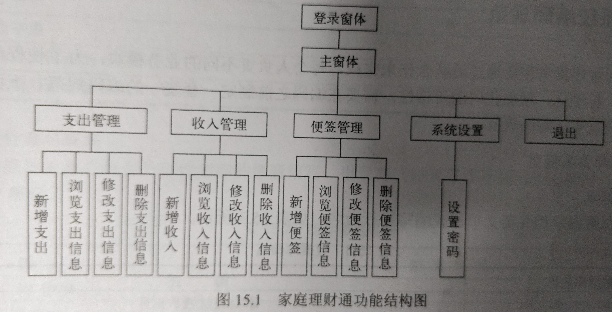
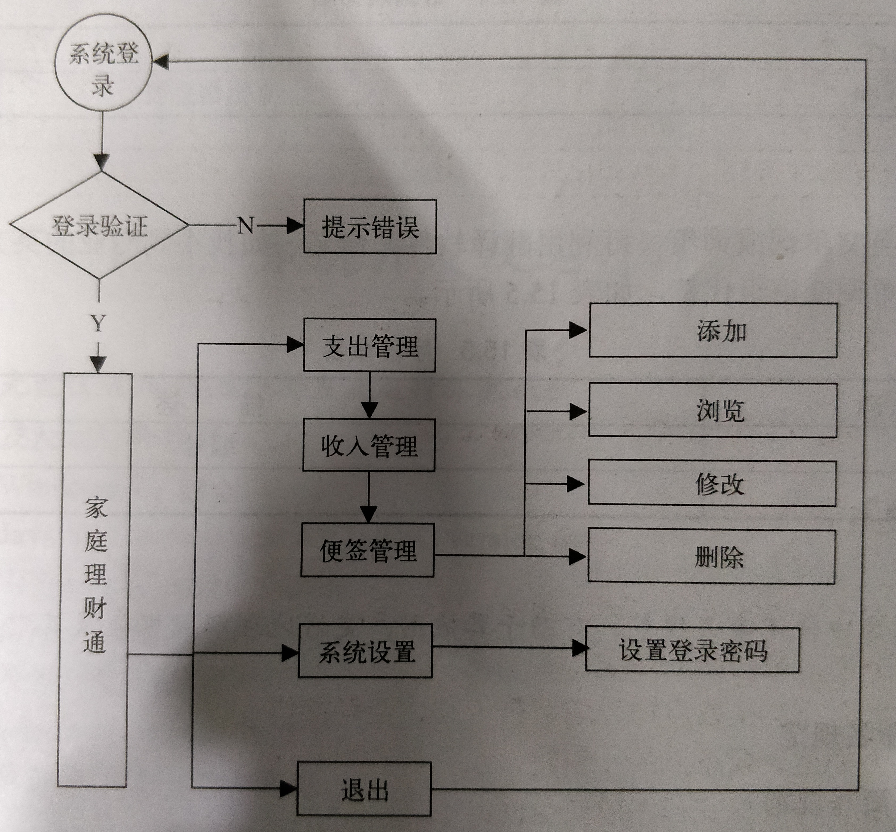

# 系统分析
## 需求分析
更好记录收支，通过密码保护隐私
## 可行性分析

## 编写项目计划书

# 系统设计
## 系统目标
## 系统功能结果

## 系统业务流程

(流程图，看着很清晰)
## 系统编码规范
开发常常团队合作，每个人负责不同的业务模块，为了
* 使程序的结构与代码风格同一标准化
* 增强代码可读性
在编码之前指定一套同一的编码规范。
### 数据库命名规范
（1）数据库
数据库以数据库相关英文单词或缩写进行命名。

| 数据库名称 | 描述     |
| :------------- | :------------- |
| account.db      | 家庭理财通数据库       |

（2）数据表
以名称tb开头，后面加数据库相关英文单词或缩写。

| 数据表名称 | 描述     |
| :------------- | :------------- |
| tb_outaccount      | 支出信息表   |

（3）字段

字段一律采用英文单词或词组命名。

| 字段名称 | 描述     |
| :------------- | :------------- |
| _id      | 编号   |
| money      | 金额  |

### 程序代码命名规范
主要包括变量、常亮、函数，另外就是组件命名，因为组件的名称写在布局文件中，最好能方便辨认。

# 系统开发及运行环境的确定
# 数据库与数据表的设计
